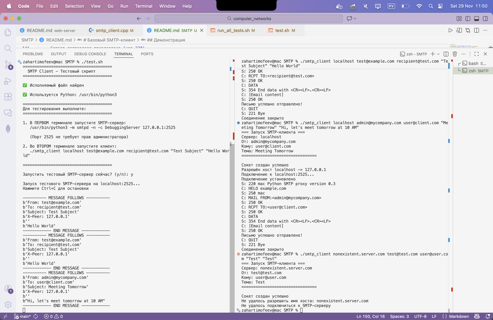

# Базовый SMTP-клиент

Простой SMTP-клиент на C++, реализующий базовый функционал отправки электронных писем через протокол SMTP.

## Описание проекта

Проект реализует базовый SMTP-клиент согласно требованиям задания:
- Установка TCP-соединения с SMTP-сервером
- Корректная последовательность SMTP-команд: `HELO`, `MAIL FROM`, `RCPT TO`, `DATA`, `QUIT`
- Обработка кодов ответа от сервера (220, 250, 354)
- Отправка простых текстовых писем
- Корректное завершение сессии и закрытие сокетов

## Технические требования

- **Язык программирования:** C++11 или выше
- **Компилятор:** g++ (для macOS/Linux)
- **Системные вызовы:** `socket()`, `connect()`, `read()`, `write()`, `close()`
- **Порт:** 2525 (по умолчанию для тестов) или 25
- **ОС:** macOS, Linux

## Сборка проекта

### Использование Makefile

```bash
make

make test

make unit-test

make clean

make help
```

## Тестирование

Проект включает полный набор автоматических тестов:

- **Unit-тесты:** 30 тестов для проверки отдельных компонентов
- **Интеграционные тесты:** 10 тестов для проверки работы с SMTP-сервером

### Быстрый запуск тестов

```bash
make test

make unit-test

make integration-test
```

## Использование

### Формат команды

```bash
./smtp_client <smtp_server> <from_email> <to_email> <subject> <body>
```

### Параметры

- `smtp_server` - адрес SMTP-сервера (например, smtp.mail.ru или localhost)
- `from_email` - адрес отправителя
- `to_email` - адрес получателя
- `subject` - тема письма (в кавычках, если содержит пробелы)
- `body` - текст письма (в кавычках, если содержит пробелы)

### Примеры использования

#### Тестирование с локальным SMTP-сервером

Рекомендуется использовать скрипт `test.sh` (подробные инструкция по запуску)

1. Запустить тестовый SMTP-сервер на Python (порт 2525):
```bash
python3 -m smtpd -n -c DebuggingServer 127.0.0.1:2525
```

2. В другом терминале запустить клиент:
```bash
./smtp_client localhost test@example.com recipient@example.com "Test Subject" "This is a test message"
```

## Структура проекта

```
SMTP/
├── smtp_client.cpp    # Основной файл с реализацией SMTP-клиента
├── Makefile          # Файл для автоматической сборки
├── README.md         # Данный файл с инструкциями
└── example_output.txt # Пример консольного вывода
```

## Принцип работы

1. **Создание сокета** - создается TCP-сокет с помощью `socket()`
2. **Разрешение DNS** - имя хоста преобразуется в IP-адрес с помощью `gethostbyname()`
3. **Подключение** - устанавливается соединение с сервером через `connect()`
4. **SMTP-диалог**:
   - Сервер отправляет приветствие (код 220)
   - Клиент: `HELO example.com` (код ответа 250)
   - Клиент: `MAIL FROM:<sender@example.com>` (код 250)
   - Клиент: `RCPT TO:<recipient@example.com>` (код 250)
   - Клиент: `DATA` (код 354)
   - Клиент отправляет заголовки и тело письма, завершая точкой на отдельной строке (код 250)
   - Клиент: `QUIT`
5. **Закрытие соединения** - сокет закрывается с помощью `close()`

## Демонстрация

