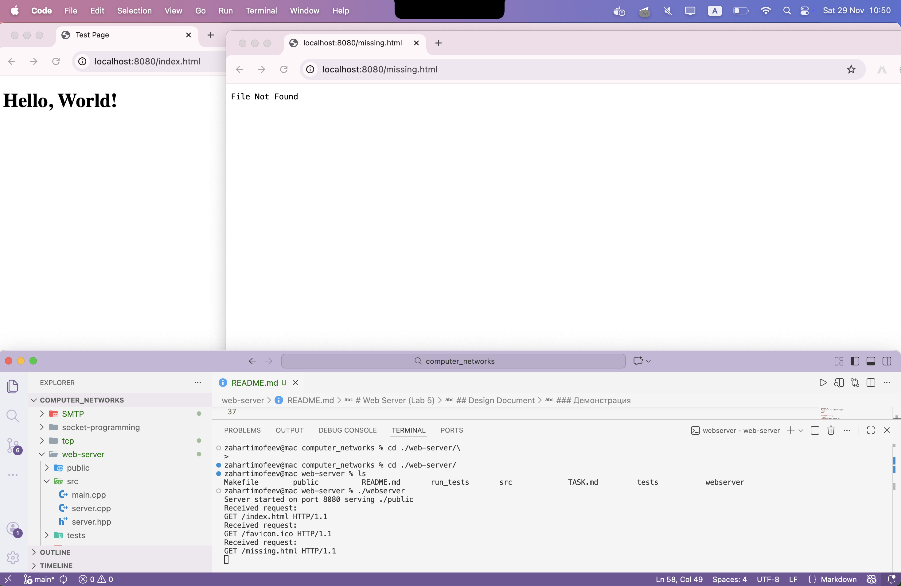

# Web Server (Lab 5)

## Design Document

### Архитектура
Приложение представляет собой многопоточный (concurrent) веб-сервер, реализованный на языке C++.
Архитектура разделена на следующие компоненты:

1.  **WebServer Class (`src/server.hpp`, `src/server.cpp`)**:
    *   Инкапсулирует логику работы с сокетами (RAII).
    *   В конструкторе инициализирует параметры (порт, директория).
    *   Метод `start()` создает сокет, привязывает его (bind), начинает прослушивание (listen) и входит в цикл приема соединений (accept).
    *   При каждом новом подключении создается отдельный поток (`std::thread`), который обрабатывает клиента в методе `handleClient`.
    *   Метод `handleClient()` обрабатывает отдельного клиента: читает запрос, парсит его, формирует ответ и отправляет его.
    *   Используется `std::mutex` для синхронизации вывода в консоль.
    *   Методы `parseRequest` и `handleRequest` отделены для удобства тестирования и логического разделения парсинга и бизнес-логики.

2.  **Структуры данных**:
    *   `HttpRequest`: Хранит распаршенные данные (метод, путь, версия).
    *   `HttpResponse`: Хранит данные для ответа (код, заголовки, тело).

3.  **Точка входа (`src/main.cpp`)**:
    *   Парсит аргументы командной строки (порт, путь к файлам).
    *   Создает экземпляр `WebServer` и запускает его.

### Инструкция по сборке и запуску

#### Требования
*   Компилятор C++ (g++ или clang++) с поддержкой C++11.
*   Make.

#### Сборка
Для сборки сервера выполните команду:
```bash
make
```

#### Запуск сервера
```bash
./webserver [port] [public_dir]
```
По умолчанию: порт 8080, директория `./public`.

Пример:
```bash
./webserver 8080 ./public
```

#### Запуск тестов
Для сборки и запуска тестов выполните:
```bash
make test
```

### Демонстрация

